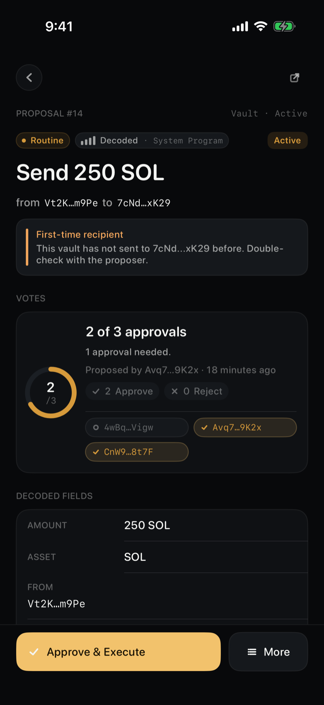
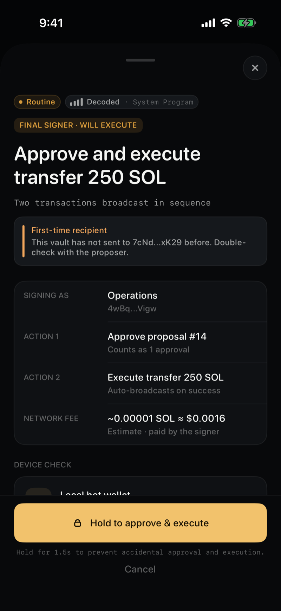
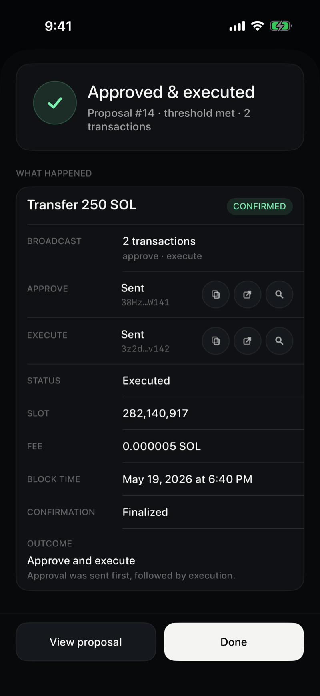

# Cosign

A native iOS signer for [Squads v4](https://squads.so) multisigs on Solana. Create a multisig, review its vault and pending proposals, then co-sign to execute, with your keys held on your device.

   

> **Beta software.** The current build runs on Solana **devnet** (a test network) and is **not security audited**. Do not use it to manage real funds. See [SECURITY.md](SECURITY.md).

<p align="center">
  
  
  
</p>

## What it is

Cosign is a thin, verifiable client for Solana Squads v4 multisig signing:

- **Create a squad.** Bootstrap a new Squads v4 multisig on-chain by choosing members and a threshold, so a fresh signer can start without waiting to be added to someone else's. Creator-only is a valid 1-of-1.
- **Decoded, inspectable proposals.** Every instruction is decoded into plain language with a severity and a confidence read. Nothing is hidden behind a blind signature.
- **Co-sign to a threshold.** See who has approved, add your signature, and watch the threshold close. Routine proposals hold-to-confirm; high-risk ones require typing a phrase.
- **Self-custody.** Keys are generated on-device or imported — from a BIP-39 recovery phrase or a raw Solana secret key — stored in the iOS Keychain or on a hardware signer, and never leave the device.
- **Hardware signers.** Ledger over Bluetooth, YubiKey over NFC or USB, with on-device address verification.
- **Relay-only.** The app talks only to the Cosign relay, which proxies Solana RPC and helps decode proposals. It holds no keys and cannot move funds.
- **Verifiable builds.** Each release embeds a signed provenance claim you can check on-device and against the published GitHub Release — see [docs/build-verification.md](docs/build-verification.md).

## Architecture

- **`core/`**: the Rust crate `cosign_core` (key derivation, signing, transaction decoding), exposed to Swift via [UniFFI](https://mozilla.github.io/uniffi-rs/), plus the relay server at `core/src/bin/relay-server.rs`.
- **`Modules/`**: the Swift app, split into focused modules: `Core`, `CosignCore` (the FFI bridge), `Indexer`, `Persistence`, `Signers`, `Squads`, `UI`.
- **`App/`**: the iOS app target.
- The Xcode project is generated by [Tuist](https://tuist.io), so there is no `.xcodeproj` in git.

## Getting started

Requirements:

- macOS with a recent Xcode (Swift 6)
- [Tuist](https://tuist.io): `brew install tuist`
- Rust (stable) with iOS targets:
  ```bash
  rustup target add aarch64-apple-ios aarch64-apple-ios-sim x86_64-apple-ios
  ```
- Lint and hooks: `brew install swiftformat swiftlint lefthook gitleaks`

Build:

```bash
lefthook install                 # wire git pre-commit hooks
./scripts/build-xcframework.sh   # build the Rust core into an XCFramework
tuist generate                   # generate the Xcode project
open Cosign.xcworkspace
```

Test:

```bash
cd core && cargo test            # Rust core + relay
# iOS: build and test the Cosign-Workspace scheme from Xcode or xcodebuild
```

## The relay

The app is a client of a single relay (the `relay-server` binary in `cosign_core`). It proxies Solana RPC with a method allowlist, proxies the Solana WebSocket so credentials stay server-side, and serves `cosign/v1` endpoints for decoded squads, proposals, account activity, and prices.

Run it locally:

```bash
cd core
COSIGN_RELAY_RPC_URL="https://devnet.helius-rpc.com/?api-key=YOUR_KEY" cargo run --bin relay-server
```

The relay can optionally serve the project's marketing site behind the `landing` cargo feature (`cargo build --bin relay-server --features landing`); the default build serves none.

## Security

Keys never leave the device, and the relay holds none. Please report vulnerabilities privately per [SECURITY.md](SECURITY.md) rather than opening a public issue.

## Contributing

See [CONTRIBUTING.md](CONTRIBUTING.md). The pre-commit hooks and CI enforce `rustfmt` + `clippy` and `swiftformat` + `swiftlint`; keep them green.

## License

[MIT](LICENSE).
